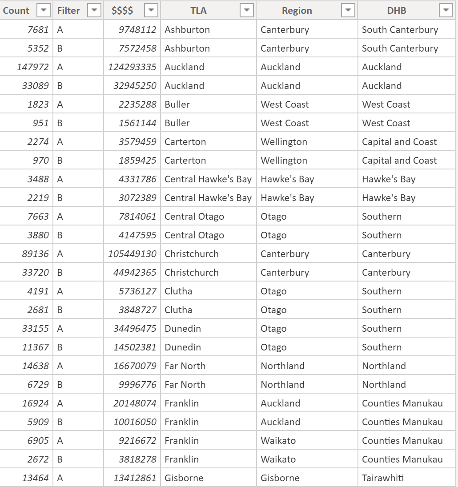

# 

<h3 align="center">New Zealand choropleth map in PowerBI</h3>

  

    Visualizaing data at different levels, easy as!
     

## How To

1. Enable shape map in Power BI --- [How to create shape map](https://docs.microsoft.com/en-us/power-bi/visuals/desktop-shape-map) 

2. Prepare data and make sure your region names are the same as the map keys 

3. Replace shape file using NZ map json files

I've uploaded the most frequently used map levels, including
- NZ Big Regions
- NZ Territorial Local Authority
- NZ District Health Board

